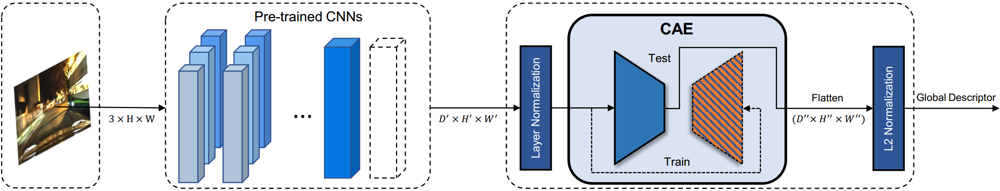

# Autoencoder-based VPR


## Code content
```c++
.
├── examples
│   ├── evaluator  // draw plots of the evaluation results
|   ├── ibl  // key modules
│   ├── extract_single_features.py  // extract a single feature
│   ├── test_convauto.py  // used to test CAE performance
│   └── train_convauto.py  // used to train CAE
├── logs  // pre-trained, trained models and evaluation results
|   ├── conv // classification pre-trained model
│   ├── convAuto  // our trained model
│   ├── netvlad  // pittsburg-trained NetVLAD
│   ├── vd16_offtheshelf_conv5_3_max.pth  // imageNet-trained VGG16
│   └── vgg16_netvlad.pth  // vgg trained by NetVLAD
├── README.md
└── scripts
    ├── test_convAuto.sh  // evaluate our VPR descriptor
    ├── train_convAuto.sh  // training script
```

## Extract a single descriptor using our trained model
Download [trained models](https://pan.baidu.com/s/1tVN6W6tmQdEvsI4W4upsHw) (keyword: wifh) and put `convauto` to `./logs`

Extract a single descriptor
```bash
python examples/extract_single_feature.py --img_path=xxx.jpg
```
- This setting will output a descriptor of 1024d by VGG16+CAE. If you want to generate othter dimension of the descriptor, please change `args` settings in the file, including `dimension` and `resume`
- output dimension = `args.dimension*32`, where `args.dimension` is the dimension of the last kernel of CAE

## CAE-based descriptor training
Download datasets from [BaiduYun-link](https://pan.baidu.com/s/14dSDY9yBr7d5VqmfG_mgCA), password: mguf

It contains:
- RobotCar: 2014-12-09-13-21-02, 2014-12-10-18-10-50, 2014-12-16-18-44-24, 2014-11-18-13-20-12, 2015-02-03-08-45-10
- Uacampus: day-night
- Norland: summer-winter

Download [pre-trained model](https://pan.baidu.com/s/1b5wpsFeMMBuzzAJ6FGhZ1A) (keyword: 3ukp) and put all files to `./logs`

Train VGG16+CAE:
```bash
# bash scripts/train_convAuto.sh ${dimension of the 1st kernel} ${dimension of the 2nd kernel} ${dimension of the last kernel} ${batch size} ${dataset directory} ${VGG16 checkpoit of NetVLAD}
bash scripts/train_convAuto.sh vgg 128 128 32 128 /data/hanjing logs/netvlad/pitts30k-vgg16/conv5-triplet-lr0.001-neg1-tuple4/model_best.pth.tar
```
- Here, we directly use weights of NetVLAD backbone for fair comparison
- output dimension = ${dimension of the last kernel}*32
- Logs file will be stored in `logs/netvlad/pitts30k-vgg16/conv5-triplet-lr0.001-neg1-tuple4`

Train AlexNet+CAE:
```bash
# bash scripts/train_convAuto.sh ${dimension of the 1st kernel} ${dimension of the 2nd kernel} ${dimension of the last kernel} ${batch size} ${dataset directory}
# "xxx" is nonsense
bash scripts/train_convAuto.sh alexnet 128 128 32 128 /data/hanjing xxx
```

## CAE-based descriptor testing
Test VGG16+CAE
```bash
# bash test_convAuto.sh ${method} ${dimension of the 1st kernel} ${dimension of the 2nd kernel} ${dimension of the last kernel} ${resume} ${dataset directory}
bash scripts/test_convAuto.sh vggConv 128 128 32 logs/convAuto/robotcar/vgg/lr0.001-bs128-islayernormTrue-d1-128-d2-128-dimension1024/checkpoint49.pth.tar /data/hanjing
```
Test AlexNet+CAE
```bash
# bash test_convAuto.sh ${method} ${dimension of the 1st kernel} ${dimension of the 2nd kernel} ${dimension of the last kernel} ${resume} ${dataset directory}
bash scripts/test_convAuto.sh alexnetConv 128 128 32 logs/convAuto/robotcar/alexnet/lr0.001-bs256-islayernormTrue-d1-128-d2-128-dimension1024/checkpoint49.pth.tar /data/hanjing
```
Test NetVLAD
```bash
# Here, "128, 128, 32" are nonsense
bash scripts/test_convAuto.sh netvlad 128 128 32 logs/netvlad/pitts30k-vgg16/conv5-triplet-lr0.001-neg1-tuple4/model_best.pth.tar /data/hanjing
```
Test VGG16
```bash
# Here, "128, 128, 32" are nonsense
bash scripts/test_convAuto.sh vgg16 128 128 32 logs/conv/vgg/model_best.pth.tar /data/hanjing
```
- Here, we directly use weights of NetVLAD backbone

Test AlexNet
```bash
# Here, "128, 128, 32, " are nonsense
bash scripts/test_convAuto.sh alexnet 128 128 32 logs/conv/alexnet/imagenet_matconvnet_alex.pth /data/hanjing
```
## Citation
If you find this repo useful for your research, please consider citing the paper
```
@inproceedings{ye2022self,
    title={Condition-Invariant and Compact Visual Place Description by Convolutional Autoencoder},
    author={Hanjing Ye, Weinan Chen, Jingwen Yu, Li He, Yisheng Guan and Hong Zhang},
    booktitle={Journal of Intelligent and Robotic Systems (under review)}
    year={2022},
}

```
## Acknowledgements
The code is largely inspired by [OpenIBL](https://github.com/yxgeee/OpenIBL)

